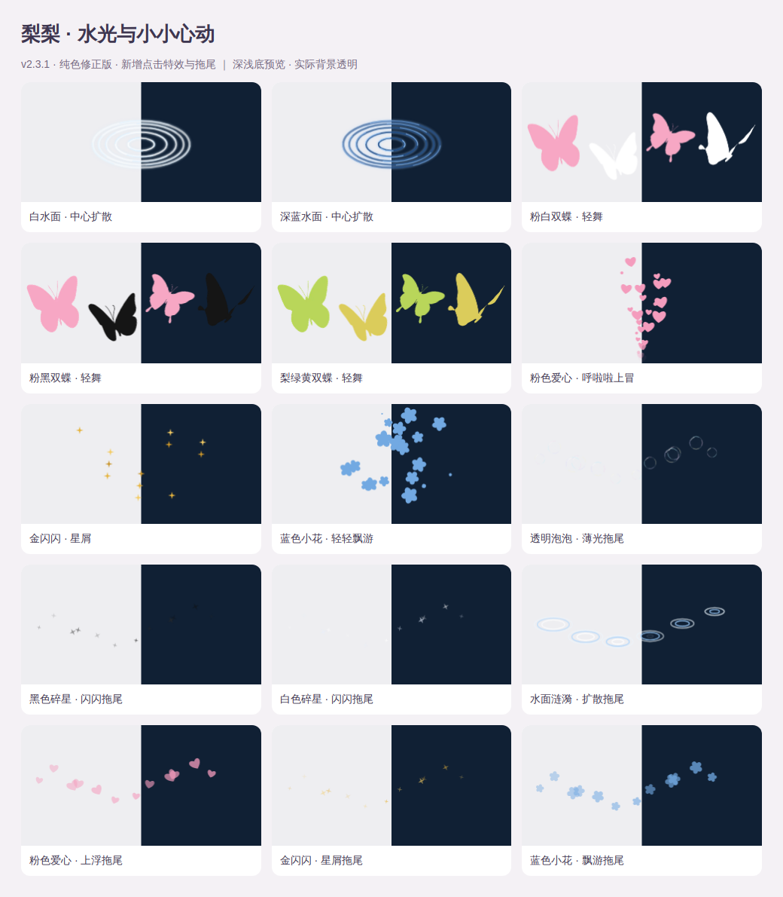
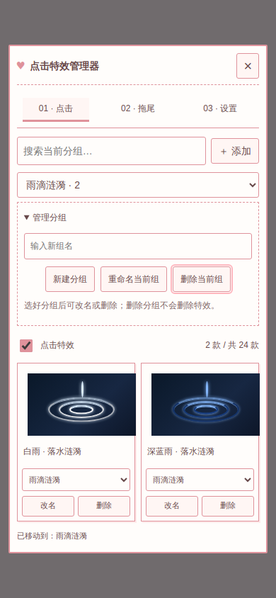

# 梨梨 · 点击与拖尾特效

SillyTavern 原生前端扩展，版本 **2.3.1**。点击绽放小图案，滑动留下细细的拖尾；手机触屏和电脑鼠标都可用。

## 安装

在酒馆的 **扩展 → 安装扩展** 中粘贴：

```text
https://github.com/pear-winter/li-sparkling
```

安装后刷新页面，从 **扩展设置 → 点击特效管理器**，或输入框旁 **魔法棒 → 点击特效管理器** 打开。

- 不需要酒馆助手、后端插件、API Key 或构建步骤。
- 如果已启用旧版“梨梨 · 点击与拖尾特效管理器”助手脚本，请先关闭旧脚本，再使用这个扩展，避免两个版本互相接管。
- 已安装的用户：在“管理扩展”中检查更新，更新后刷新。
- 手动安装：下载本仓库 ZIP，解压到酒馆的 `data/<用户>/extensions/li-sparkling`，保证 `manifest.json` 位于扩展文件夹根目录，重启或刷新酒馆。
- 仓库中的 v1.8 JSON 仅保留作历史备份；安装扩展不需要再导入它。

## 内置特效

共 **31 款点击特效 + 12 组拖尾**。

| 类别 | 款式与表现 |
| --- | --- |
| 剪影蝴蝶 | 白蝶、黑蝶、黑白双蝶、红蝶、粉蝶、梨蝶、粉白双蝶、粉黑双蝶、梨绿黄双蝶；扇翅上飞，配相应颜色的小闪闪 |
| 雪花 | 黑、白两款；六角实心图形，无对比色描边，缓缓旋转飘落，伴随细小微粒 |
| 音符 | 黑、白两款；包含 ♩ ♪ ♫ ♬ ¶ ♯ ♭，轻轻上浮，伴随同色小粒子 |
| 雨滴涟漪 | 白雨、深蓝雨；水滴落下、小水珠溅起、三圈椭圆水纹逐渐扩散；另有白色、深蓝色水面扩散，所有波圈固定以点击处为中心；深蓝带细蓝反光，在暗色背景也能看清 |
| 虹彩泡泡 | 透明中心、薄薄的彩色反光和白色高光；大小不同，上浮、轻晃，破裂时散成小水珠 |
| 爱心、星星与小花 | 纯粉色实心爱心分批向上涌、黑白星屑原样换成金色、纯蓝色实心五瓣小花轻轻飘游，伴随细小粒子 |
| 原有 10 组 | 奶油爱心、星星糖霜、粉白像素、黑白碎片与星屑、霓虹、梨梨黄绿等 |
| 拖尾 | 奶油粉白、赛博霓虹、黑白银线、黄绿糖丝、蓝紫极光；新增透明薄光泡泡、黑色碎星、白色碎星、水面涟漪、粉色爱心、金色小星星、蓝色小花 |

所有内置素材随扩展下载，无需图床。雪花和音符使用固定矢量图形，手机不会把它们自动换成彩色 emoji；黑色适合浅底、白色适合深底。图库中使用深浅双色底方便查看，实际效果始终透明。

雪花、音符和泡泡均为本项目新绘制的轻量矢量图形；参考图片仅用于观察形态和质感，没有裁切参考截图或使用其中的水印素材。蝴蝶保留用户提供的原始透明素材。




## 使用与设置

- **点击页**：按分组筛选与搜索、点图预览并启用、改名、删除与撤销。
- **分组**：预先分为爱心与闪光、星星与星屑、蓝色小花、像素粒子、蝴蝶、泡泡、音符、雪花、雨滴涟漪、霓虹、梨梨与黄绿。可在“管理分组”中新建、重命名和删除分组；每张卡片的下拉框可移动特效。删除组会把特效移到“未分组”，不会删除特效。分组在同一浏览器中保存，恢复特效默认设置也会保留自建分组。
- **拖尾页**：独立开关、12 款拖尾、滑动测试区。
- **设置页**：调节点击数量与大小、拖尾数量/粗细/时长，开启省电模式，恢复默认或恢复内置特效。
- 可上传 PNG / JPG / WebP / GIF，或导入 `lili-click-effects` v1 特效包。一组最多 12 张图，自定义最多 20 组。
- “导出当前特效”会把内置本地素材转成可携带的 PNG 数据，可再次导入本扩展。雪花/音符运动模式需要 v2.0 及以上，雨滴涟漪需要 v2.1 及以上；中心扩散、爱心上涌、金星与蓝花需要 v2.3 及以上。双色蝴蝶导出时会烘焙色相，重新导入仍保留双色。
- 设置继续使用原脚本的浏览器存储。同一浏览器、同一酒馆地址下，原设置和上传特效会保留；切换地址、浏览器或设备不会自动同步。
- v2.1 移除本项目四款花瓣和对应的旧导入副本；泡泡、音符、雪花、蝴蝶及其他自定义素材保留。恢复内置特效不会再带回花瓣。

动画层不拦截输入或滚动；同时限制粒子和拖尾数量，空闲时停止动画帧，切换后台时清空动画。支持同源 iframe 内的点击，跨域或禁止同源访问的 iframe 受浏览器限制。



## 工作台连接（v2.2.0 起）

梨梨工作台 v3.9.1 的“特效”页直接嵌入已启用插件的管理器。点击、拖尾、设置、分组和以后新增的 UI 都使用插件同一份实现与存储。没有安装或没有启用插件时，只显示提示，不启动备用特效引擎。更新、启用插件后刷新酒馆即可。

工作台关闭、切页、停用只卸载自己的管理器视图，不停止插件特效。

稳定接口 `window.__liSparkling`（`apiVersion: 1`）：

- `owner === 'li-sparkling'`、`version`、`isAvailable()`：确认当前已启用的插件。
- `mount(container)`：把完整管理器放进酒馆同源页面的容器，返回 DOM 元素。
- `unmount(container)`：仅移除该容器里的视图；不会影响其他容器或动画引擎。
- `openManager(page)`：打开管理器；已有嵌入视图时复用该视图。
- `li-sparkling:change`（window 事件）：插件可用性或实例更换通知，连接方重新读取接口。

一次保留一个管理器视图，所有入口共享其状态。未来版本保留 v1 连接接口；工作台不复制渲染器、资源列表或设置逻辑，也不会远程下载代码执行。示例连接层位于 `integrations/workbench-effects.js`。

## 开发与验证

直接修改 `index.js`、`style.css`、`assets.js`、`seasonal.js`、`groups.js`、`ripples.js`、`ornaments.js`；无需打包。

```sh
npm install
npx playwright install chromium
npm test
```

测试启动临时本机 HTTP 服务，检查移动端布局、全部素材加载、动画、设置迁移、菜单重建恢复、触屏/iframe、导出导入及启停清理。可用 `CHROMIUM_PATH` 指定已有 Chromium；`TEST_ARTIFACTS` 指定截图目录。

```sh
python3 scripts/generate-seasonal.py
```

以上命令重新生成本项目原创的季节/音符 SVG 及 `seasonal.js`；不修改蝴蝶素材。

这些自动检查使用模拟酒馆页面，不能替代每一种酒馆版本、手机 WebView 和第三方主题下的实际使用验证。

## 2.3.1 更新

- 金色星屑直接复用黑白星屑的四尖星形、大小和运动，仅更换颜色；金色拖尾使用相同星形。
- 爱心与蓝色小花的点击、拖尾统一改为纯色实心，无渐变、高光、描边或异色花心。
- 内置梨梨两款特效也改用绘制图形；所有内置效果均不依赖 emoji。保留用户已导入素材的兼容性。

## 2.3.0 更新

- 雨滴组新增白色、深蓝色水面扩散，波纹中心始终对齐点击位置。
- 新增粉白、粉黑、梨绿黄双蝶，每次成对取色；保留原有六款蝴蝶。
- 新增粉色爱心上涌、金色小星星、蓝色小花点击动画，以及七款对应的新拖尾。
- 新增星星与星屑、蓝色小花分组，保留用户已有分组与移动记录。
- 工作台自动显示插件新增功能，连接脚本无需更换。

## 2.2.0 更新

- 提供稳定的插件嵌入接口，工作台直接使用插件的完整管理器。
- 支持插件晚于工作台加载、启停和实例替换后的重新连接。
- 管理器支持嵌入视图；卸载视图不销毁动画引擎。

## 2.1.0 更新

- 增加自动分类、自建分组、重命名、删除分组和移动特效，保存用户分组。
- 新增白雨、深蓝雨两款动态落水涟漪，扩散水纹伴随小水珠。
- 移除四款花瓣以及之前导入的同款副本，保留其他内置和自定义特效。
- 验证移动端分组操作、刷新持久化、雨滴导出导入及旧花瓣清理。

## 2.0.0 更新

- 从助手脚本升级为可从仓库地址安装的原生扩展。
- 内置六组蝴蝶；新增黑白雪花、黑白音符；重做四色花瓣和虹彩泡泡。
- 保留仓库 v1.8.1 的菜单入口恢复和页面缓存恢复修复，合入上传 v1.9 的飘落/泡泡运动。
- 内置图片拆成可缓存的本地文件，相同图片去重；不再将全部图片塞在主 JS 中。
- 增加可移植导出、旧特效保留迁移及扩展禁用清理。
