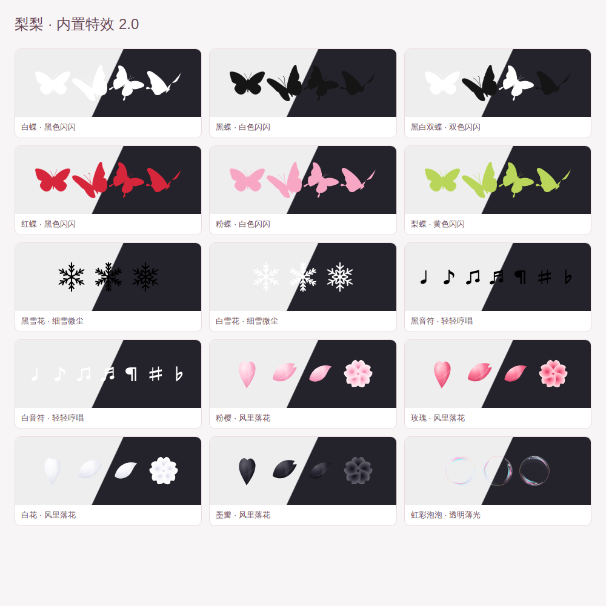

# 梨梨 · 点击与拖尾特效

SillyTavern 原生前端扩展，版本 **2.0.0**。点击绽放小图案，滑动留下细细的拖尾；手机触屏和电脑鼠标都可用。

## 安装

在酒馆的 **扩展 → 安装扩展** 中粘贴：

```text
https://github.com/pear-winter/li-sparkling
```

安装后刷新页面，从 **扩展设置 → 点击特效管理器**，或输入框旁 **魔法棒 → 点击特效管理器** 打开。

- 不需要酒馆助手、后端插件、API Key 或构建步骤。
- 如果已启用旧版“梨梨 · 点击与拖尾特效管理器”助手脚本，请先关闭旧脚本，再使用这个扩展，避免两个版本互相接管。
- 已安装的用户：在“管理扩展”中检查更新，更新后刷新。
- 手动安装：下载本仓库 ZIP，解压到酒馆的 `data/<用户>/extensions/li-sparkling`，保证 `manifest.json` 位于扩展文件夹根目录，重启或刷新酒馆。
- 仓库中的 v1.8 JSON 仅保留作历史备份；安装扩展不需要再导入它。

## 内置特效

共 **25 组点击特效 + 5 组拖尾**。

| 类别 | 款式与表现 |
| --- | --- |
| 剪影蝴蝶 | 白蝶、黑蝶、黑白双蝶、红蝶、粉蝶、梨蝶；扇翅上飞，配相应颜色的小闪闪 |
| 雪花 | 黑、白两款；六角实心图形，无对比色描边，缓缓旋转飘落，伴随细小微粒 |
| 音符 | 黑、白两款；包含 ♩ ♪ ♫ ♬ ¶ ♯ ♭，轻轻上浮，伴随同色小粒子 |
| 花瓣 | 粉樱、玫瑰、白花、墨瓣；重画卷曲花瓣、折光和五瓣小花，大小错落，翻转飘落 |
| 虹彩泡泡 | 透明中心、薄薄的彩色反光和白色高光；大小不同，上浮、轻晃，破裂时散成小水珠 |
| 原有 10 组 | 奶油爱心、星星糖霜、粉白像素、黑白碎片与星屑、霓虹、梨梨黄绿等 |
| 拖尾 | 奶油粉白、赛博霓虹、黑白银线、黄绿糖丝、蓝紫极光 |

所有内置素材随扩展下载，无需图床。雪花和音符使用固定矢量图形，手机不会把它们自动换成彩色 emoji；黑色适合浅底、白色适合深底。图库中使用深浅双色底方便查看，实际效果始终透明。

花瓣、雪花、音符和泡泡均为本项目新绘制的轻量矢量图形；参考图片仅用于观察形态和质感，没有裁切参考截图或使用其中的水印素材。蝴蝶保留用户提供的原始透明素材。



## 使用与设置

- **点击页**：搜索、点图预览并启用、改名、删除与撤销。
- **拖尾页**：独立开关、5 款拖尾、滑动测试区。
- **设置页**：调节点击数量与大小、拖尾数量/粗细/时长，开启省电模式，恢复默认或恢复内置特效。
- 可上传 PNG / JPG / WebP / GIF，或导入 `lili-click-effects` v1 特效包。一组最多 12 张图，自定义最多 20 组。
- “导出当前特效”会把内置本地素材转成可携带的 PNG 数据，可再次导入本扩展。新雪花/音符运动模式需要 v2.0 及以上。
- 设置继续使用原脚本的浏览器存储。同一浏览器、同一酒馆地址下，原设置和上传特效会保留；切换地址、浏览器或设备不会自动同步。
- 旧导入花瓣/泡泡保留为自定义副本，新内置版本单独可选；恢复默认不会删除上传内容。

动画层不拦截输入或滚动；同时限制粒子和拖尾数量，空闲时停止动画帧，切换后台时清空动画。支持同源 iframe 内的点击，跨域或禁止同源访问的 iframe 受浏览器限制。

## 开发与验证

直接修改 `index.js`、`style.css`、`assets.js`、`seasonal.js`；无需打包。

```sh
npm install
npx playwright install chromium
npm test
```

测试启动临时本机 HTTP 服务，检查移动端布局、全部素材加载、动画、设置迁移、菜单重建恢复、触屏/iframe、导出导入及启停清理。可用 `CHROMIUM_PATH` 指定已有 Chromium；`TEST_ARTIFACTS` 指定截图目录。

```sh
python3 scripts/generate-seasonal.py
```

以上命令重新生成本项目原创的季节/音符 SVG 及 `seasonal.js`；不修改蝴蝶素材。

这些自动检查使用模拟酒馆页面，不能替代每一种酒馆版本、手机 WebView 和第三方主题下的实际使用验证。

## 2.0.0 更新

- 从助手脚本升级为可从仓库地址安装的原生扩展。
- 内置六组蝴蝶；新增黑白雪花、黑白音符；重做四色花瓣和虹彩泡泡。
- 保留仓库 v1.8.1 的菜单入口恢复和页面缓存恢复修复，合入上传 v1.9 的飘落/泡泡运动。
- 内置图片拆成可缓存的本地文件，相同图片去重；不再将全部图片塞在主 JS 中。
- 增加可移植导出、旧特效保留迁移及扩展禁用清理。
